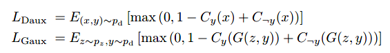
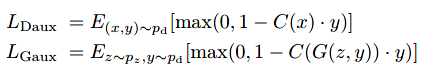
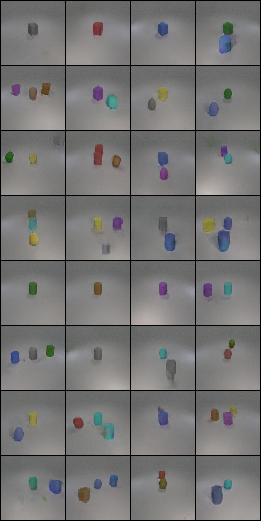

# MHingeGAN for multi-label conditional generation

Use MHingeGAN to do multi-label conditional generation on CLEVR dataset.

## Some Changes for Adapting Multi-Label Condition

* `Loss Function`:  
Origin loss functions of the auxiliary classifier are:  
  
New loss functions in this project are:  

* `Initialization`:  
Initialize weights of conditional batch normalization layers in the generator with [nn.init.orthogonal_] instead of [nn.init.ones_].

## Images

All the training images are in `./image`

## Labels

* `./label/objects.json`  
This file is a dictionary file that contains the number of objects and the idexes.
There are totally 24 objects in i-CLEVR datasets with 3 shapes and 8 colors.

* `./label/train.json`  
The file is for training. The number off training data is 18012.
train.json is a dictionary where keys are filenames and values are objects/
For example:
{"CLEVR_train_001032_0.png": ["yellow sphere"], 
"CLEVR_train_001032_1.png": ["yellow sphere", "gray cylinder"], 
"CLEVR_train_001032_2.png": ["yellow sphere", "gray cylinder", "purple cube"], ... }
One image can include objects from 1 to 3

* `./label/test.json`  
The file is for testing. The number of testing data is 32.
test.json is a list where each element includes multiple objects
For example:
[['gray cube'],
['red cube'],
['blue cube'],
['blue cube', 'green cube'], ...]

## Experiment

(./label/test.json)  
  
Accuracy evaluated by `./model/eval_model/classifier_weight.pth`(Resnet18) = 0.83

## Reference
https://openaccess.thecvf.com/content/WACV2021/papers/Kavalerov_A_Multi-Class_Hinge_Loss_for_Conditional_GANs_WACV_2021_paper.pdf
